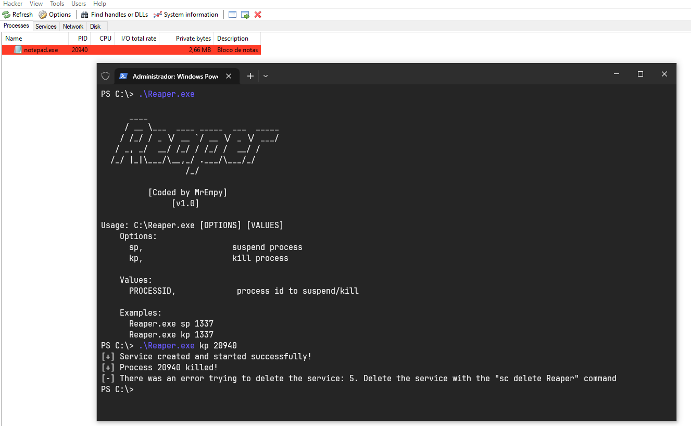

<h1 align="center">「💀」 About Reaper</h1>

<p align="center"></p>

Reaper is a hacking tool designed to exploit BYOVD (Bring Your Own Vulnerable Driver) driver vulnerability. This malicious technique involves inserting a legitimate, vulnerable driver into a target system, which allows attackers to exploit the driver to perform malicious actions.

Reaper was specifically designed to exploit the vulnerability present in the kprocesshacker.sys driver in version 2.8.0.0, taking advantage of its weaknesses to gain privileged access and control over the target system.

## Features

* Kill process
* Suspend process

## Help

```
      ____
     / __ \___  ____ _____  ___  _____
    / /_/ / _ \/ __ `/ __ \/ _ \/ ___/
   / _, _/  __/ /_/ / /_/ /  __/ /
  /_/ |_|\___/\__,_/ .___/\___/_/
                  /_/

          [Coded by MrEmpy]
               [v1.0]

Usage: C:\Windows\Temp\Reaper.exe [OPTIONS] [VALUES]
    Options:
      sp,                   suspend process
      kp,                   kill process

    Values:
      PROCESSID             process id to suspend/kill

    Examples:
      Reaper.exe sp 1337
      Reaper.exe kp 1337
```

## Demonstration



## Install

You can compile it directly from the source code or [download it already compiled](https://github.com/MrEmpy/Reaper/releases/). You will need Visual Studio 2022 to compile.

**Note:** The executable and driver must be in the same directory.


## Buy me a coffee?

<a href="https://livepix.gg/mrempy" target="_blank">
  
</a>
</br>
<a href="https://www.buymeacoffee.com/mrempy" target="_blank">
  
</a>
